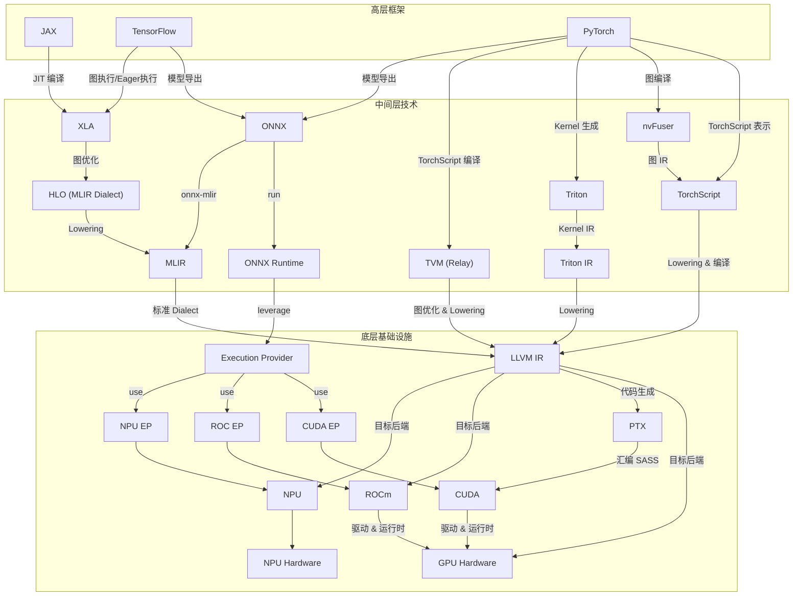

## 引言

整理一下当前主流的 GPU 技术栈进行概览，并重点探讨其关键组件及其连接方式。

## 技术栈图解

下面的 Mermaid 图展示了 GPU 技术栈的主要组件及其逻辑关系。

## 技术栈概览

该技术栈可以大致分为三个主要层次：底层基础设施、中间层技术和高层框架。

### 1. 底层基础设施

这一层是整个计算能力的基石，直接与硬件及其编程接口相关。

#### CUDA
- NVIDIA 的并行计算平台和编程模型。
- 提供了 C/C++ 语言扩展以及丰富的库，允许开发者直接利用 NVIDIA GPU 的并行计算能力。
- 是 NVIDIA 硬件生态的核心。

#### ROCm
- AMD 的开源 GPU 计算平台。
- 旨在提供与 CUDA 竞争的功能，支持多种 AMD GPU 架构。

#### NPU (Neural Processing Unit)
- 专为加速神经网络计算设计的专用处理器。
- 代表产品包括华为昇腾、寒武纪、Intel Habana 等。
- 通常提供高能效比和特定的指令集，需要专门的软件栈支持（如通过 MLIR、TVM、XLA 等后端）。

#### LLVM (Low Level Virtual Machine)
- 一个成熟的开源编译器基础设施项目。
- 提供了一套强大的中间表示（IR）和用于构建编译器前端及后端的工具。
- 是许多现代编译器（包括 GPU 编译器）的核心组件，负责代码优化和跨平台代码生成。

### 2. 中间层技术

这一层是连接高层抽象与底层硬件的关键，负责计算图的表示、优化和向底层代码的转换。

#### MLIR (Multi-Level Intermediate Representation)
- 一个灵活、可扩展的编译器基础设施，支持表示多种抽象层次的程序。
- 通过引入方言（Dialects）机制，能够统一表示从高层计算图到低层硬件指令等不同领域的IR。
- 正成为连接深度学习框架、特定领域加速器（如 NPU）和传统编译器基础设施（如 LLVM）的重要桥梁。

#### XLA (Accelerated Linear Algebra)
- TensorFlow 和 JAX 使用的特定领域编译器。
- 专注于数值计算图的优化，例如操作融合、内存优化等。
- 其高级中间表示 HLO (High Level Optimizer) 常被用作 MLIR 的一个方言（`mhlo`），实现与 MLIR 生态的融合。

#### Triton
- 一种高级编程语言和编译器，用于编写高效的 GPU Kernel。
- 旨在简化 GPU 编程，通过自动化优化和代码生成实现媲美甚至超越手写 CUDA 的性能。
- 与 MLIR 有着紧密的集成。

#### TVM (Apache Tensor Virtual Machine)
- 一个端到端、自动优化的深度学习编译器堆栈。
- 包含多级中间表示（如 Relay 用于图级别，TensorIR/TE 用于计算级别）和自动化调优机制。
- 目标是为多种硬件后端（包括 GPU、CPU、NPU 等）生成优化的代码。

#### ONNX (Open Neural Network Exchange)
- 一种用于表示深度学习模型的开放格式。
- 旨在促进不同深度学习框架之间的模型互操作性。
- 通常用作模型导出、交换和部署的标准格式，通过 ONNX Runtime (ORT) 或与其他编译器（如 ONNX-MLIR）结合实现跨平台推理。

### 3. 高层框架

这是开发者构建、训练和部署模型的常用工具。

#### TensorFlow
- 谷歌开发的开源机器学习框架，拥有庞大的社区和生态系统。
- 支持静态图和动态图执行，通过 XLA 实现性能优化。

#### PyTorch
- Meta 开发的机器学习框架，以其灵活的动态图和易用性受到研究界的欢迎。
- 通过 TorchScript、nvFuser、与 Triton 集成等方式不断提升性能和部署能力。

#### JAX
- 谷歌开发的基于 Autograd 和 XLA 的数值计算库。
- 强调函数式编程风格，通过 XLA 提供了强大的 JIT 编译、自动微分和自动并行化能力。

## 技术栈连接与转换流程

高层框架中定义的计算（通常表示为计算图）需要经过一系列转换和优化才能在底层硬件上高效执行。

1.  **从框架到中间表示：**
    * TensorFlow 和 JAX 通常通过 XLA 将其计算图转换为 HLO。
    * PyTorch 可以导出为 ONNX 格式，或通过 TorchScript 表示。
    * 这些框架的中间表示（如 HLO、TorchScript）或标准交换格式（ONNX）为后续的优化和代码生成奠定基础。

2.  **中间表示的优化与转换：**
    * HLO 可以在 XLA 中进行图级别的优化，然后可能被转换为 MLIR 的 `mhlo` 方言，以便利用 MLIR 的基础设施进行进一步处理。
    * ONNX 模型可以通过 ONNX-MLIR 等工具转换为 MLIR 表示，或由 ONNX Runtime 直接加载，并利用其 Execution Provider (EP) 机制调用特定硬件后端。
    * TVM 从框架 IR 或 ONNX 接收模型，进行图优化和低层表示转换（如到 TensorIR），最终生成代码。
    * Triton 将其高级语言表示转换为 Triton IR，然后 Lowering 到 LLVM IR。
    * MLIR 作为统一平台，可以接收来自不同源（HLO、ONNX、Triton 等）的表示，并进行跨领域、跨层次的优化，最终转换为标准的 MLIR 方言或直接 Lowering 到 LLVM IR。

3.  **从中间表示到硬件：**
    * LLVM IR 是通用的低级中间表示，可以被 LLVM 的后端编译为针对特定目标硬件（x86 CPU, ARM CPU, NVIDIA GPU (通过 PTX), AMD GPU, NPU 等）的机器码。
    * 对于 NVIDIA GPU，LLVM 通常生成 PTX (Parallel Thread Execution)，这是一种虚拟指令集，再由 NVIDIA 驱动编译为 SASS (硬件原生指令集)，通过 CUDA 运行时加载执行。
    * ROCm 和 NPU 等硬件后端也通常通过各自的编译器或 LLVM 后端接收中间表示并生成目标代码。

## 实际应用案例

这个技术栈的协同工作在实际中带来了显著的性能提升和开发便利性。

### 深度学习模型优化

-   **高性能 Kernel:** 利用 Triton 等工具可以直接编写或生成针对特定操作（如注意力机制中的矩阵乘法）高度优化的 GPU Kernel，取代通用实现，大幅提升模型性能。
-   **图级优化:** XLA 和 TVM 等编译器通过操作融合、内存重排等方式优化整个计算图的执行，减少开销。
-   **跨平台部署:** ONNX 使得在不同框架训练的模型能够在各种推理引擎和硬件上高效运行，简化了部署流程。

### 科学计算应用

-   **加速模拟:** 利用 CUDA/ROCm 直接编写并行算法，或通过 JAX/TensorFlow 等框架结合 XLA 编译能力，将分子动力学、流体模拟等计算密集型任务加速数十到数百倍。
-   **代码生成效率:** LLVM 和 MLIR 等编译器基础设施提供了强大的优化能力，能将高级数学表达式或领域特定语言高效地转换为 GPU/NPU 上的并行代码。

## 参考文献

### 官方文档
1. [MLIR 官方文档](https://mlir.llvm.org/)
2. [CUDA 编程指南](https://docs.nvidia.com/cuda/)
3. [LLVM 文档](https://llvm.org/docs/)
4. [TensorFlow XLA 文档](https://www.tensorflow.org/xla)
5. [PyTorch 2.0 文档](https://pytorch.org/docs/stable/)
6. [JAX 文档](https://jax.readthedocs.io/)
7. [TVM 文档](https://tvm.apache.org/docs/)
8. [ONNX 文档](https://onnx.ai/)
9. [Triton 文档](https://triton-lang.org/)

### 研究论文
1. [Triton: An Intermediate Language and Compiler for Tiled Neural Network Computations](https://arxiv.org/abs/2104.13678)
2. [TVM: An Automated End-to-End Optimizing Compiler for Deep Learning](https://arxiv.org/abs/1802.04799)
3. [MLIR: A Compiler Infrastructure for the End of Moore's Law](https://arxiv.org/abs/2002.11054)
4. [XLA: TensorFlow, Compiled](https://arxiv.org/abs/2105.02649)
5. [JAX: Autograd and XLA](https://arxiv.org/abs/2111.00213)

### 技术博客
1. [NVIDIA Developer Blog](https://developer.nvidia.com/blog/)
2. [Google AI Blog](https://ai.googleblog.com/)
3. [PyTorch Blog](https://pytorch.org/blog/)
4. [TensorFlow Blog](https://blog.tensorflow.org/)
5. [LLVM Blog](https://blog.llvm.org/)

### 教程资源
1. [CUDA C++ Programming Guide](https://docs.nvidia.com/cuda/cuda-c-programming-guide/)
2. [MLIR Tutorial](https://mlir.llvm.org/docs/Tutorials/)
3. [TVM Tutorial](https://tvm.apache.org/docs/tutorial/index.html)
4. [PyTorch CUDA Tutorial](https://pytorch.org/tutorials/beginner/blitz/tensor_tutorial.html)
5. [TensorFlow GPU Guide](https://www.tensorflow.org/guide/gpu)

### 社区资源
1. [NVIDIA Developer Forums](https://forums.developer.nvidia.com/)
2. [PyTorch Discussion Forums](https://discuss.pytorch.org/)
3. [TensorFlow Discussion](https://discuss.tensorflow.org/)
4. [LLVM Discourse](https://discourse.llvm.org/)
5. [MLIR Discussion](https://llvm.discourse.group/c/mlir/31)

### 性能优化指南
1. [CUDA Best Practices Guide](https://docs.nvidia.com/cuda/cuda-c-best-practices-guide/)
2. [PyTorch Performance Tuning Guide](https://pytorch.org/tutorials/recipes/recipes/tuning_guide.html)
3. [TensorFlow Performance Guide](https://www.tensorflow.org/guide/performance/overview)
4. [TVM Performance Tuning](https://tvm.apache.org/docs/how_to/tune_with_autoscheduler/tune_conv2d_cuda.html)
5. [MLIR Performance Optimization](https://mlir.llvm.org/docs/Passes/)

### 工具和库
1. [NVIDIA Nsight](https://developer.nvidia.com/nsight-systems)
2. [CUDA Profiler](https://docs.nvidia.com/cuda/profiler-users-guide/)
3. [PyTorch Profiler](https://pytorch.org/tutorials/recipes/recipes/profiler_recipe.html)
4. [TensorFlow Profiler](https://www.tensorflow.org/guide/profiler)
5. [LLVM Opt](https://llvm.org/docs/CommandGuide/opt.html)

### 会议和演讲
1. [GTC Conference](https://www.nvidia.com/gtc/)
2. [MLIR Conference](https://mlir.llvm.org/OpenMeetings/)
3. [PyTorch Conference](https://pytorch.org/events/)
4. [TensorFlow Dev Summit](https://www.tensorflow.org/dev-summit)
5. [LLVM Developers' Meeting](https://llvm.org/devmtg/)
