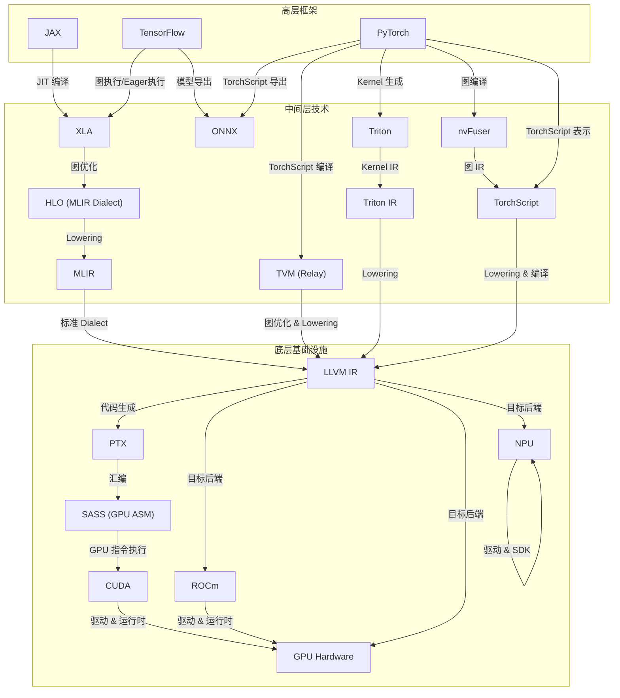

## 引言

在当今的 AI 和科学计算领域，GPU 编程已经成为不可或缺的一部分。从底层的 CUDA 到高层的深度学习框架，整个技术栈形成了一个复杂的生态系统。

## 技术栈图解

## 技术栈概览

### 1. 底层基础设施

#### CUDA
- NVIDIA 的 GPU 编程平台
- 提供 C/C++ 扩展
- 直接操作 GPU 硬件
- 性能优化的基础

#### ROCm
- AMD 的 GPU 编程平台
- 开源 GPU 计算生态系统
- 支持多种 GPU 架构
- 与 CUDA 兼容的接口

#### NPU (Neural Processing Unit)
- 专为神经网络计算设计的处理器
- 主要产品：
  - 华为昇腾 (Ascend)
  - 寒武纪 (Cambricon)
  - Intel Habana
  - 云天励飞 
- 特点：
  - 专用神经网络加速
  - 高能效比
  - 定制化指令集
- 支持方式：
  - 通过 MLIR 后端
  - 通过 TVM 支持
  - 通过 XLA 后端

#### LLVM
- 编译器基础设施
- 提供中间表示（IR）
- 支持多种目标平台
- 优化和代码生成的基础

### 2. 中间层技术

#### MLIR
- 多级中间表示
- 连接高层框架和底层硬件
- 支持领域特定优化
- 提供统一的编译器基础设施

#### XLA (Accelerated Linear Algebra)
- TensorFlow 和 JAX 的编译器
- 将计算图转换为优化的机器代码
- 主要优化技术：
  - 操作融合（Operation Fusion）
  - 内存优化
  - 自动并行化
  - 设备特定优化
- 支持多种硬件后端：
  - GPU (CUDA)
  - CPU
  - TPU
  - 自定义硬件

#### Triton
- 高级 GPU 编程语言
- 简化 GPU 编程
- 自动优化和并行化
- 与 MLIR 深度集成

#### TVM
- 多级中间表示
- 连接高层框架和底层硬件
- 支持领域特定优化
- 提供统一的编译器基础设施
- 与 XLA/HLO 的集成：
  - 支持 HLO 格式导入
  - 共享优化策略
  - 互补的优化能力
  - 灵活的代码生成

#### ONNX (Open Neural Network Exchange)
- 开放式神经网络交换格式
- 主要特点：
  - 跨框架模型交换标准
  - 支持多种深度学习框架
  - 统一的模型表示格式
  - 丰富的算子集
- 核心功能：
  - 模型导出和导入
  - 模型优化和转换
  - 跨平台部署
  - 硬件加速支持
- 与主流框架的集成：
  - PyTorch 集成：
    - 原生支持 ONNX 导出（`torch.onnx`）
    - 支持动态图和静态图模型
    - 提供丰富的导出选项
    - 支持自定义算子
  - TensorFlow 集成：
    - 通过 `tf2onnx` 工具支持
    - 支持 SavedModel 格式转换
    - 支持 Keras 模型导出
    - 提供模型优化功能
- 实际应用场景：
  - 模型部署：
    - 将 PyTorch/TensorFlow 模型转换为 ONNX
    - 在不同推理引擎上运行
    - 支持边缘设备部署
  - 模型优化：
    - 跨框架模型优化
    - 硬件特定优化
    - 性能调优
  - 跨平台支持：
    - 支持多种硬件后端
    - 统一的推理接口
    - 简化的部署流程

### 3. 高层框架

#### TensorFlow
- Google 的深度学习框架
- 使用 XLA 编译器
- 支持多种后端
- 大规模分布式训练

#### PyTorch
- Meta 的深度学习框架
- 动态计算图
- 与 Triton 集成
- 灵活的模型开发

#### JAX
- Google 的深度学习框架
- 使用 XLA 编译器
- 支持多种后端
- 大规模分布式训练

## 技术栈连接

### TensorFlow 到 MLIR 的转换过程

TensorFlow 通过 XLA 编译器实现代码优化，具体流程如下：

1. **TensorFlow 计算图**
   - TensorFlow 首先将 Python 代码转换为计算图
   - 计算图包含操作（Operations）和张量（Tensors）
   - 支持静态图和动态图两种模式

2. **XLA 编译流程**
   - 计算图首先被转换为 HLO (High Level Optimizer) IR
   - HLO 是一个中间表示，专注于线性代数操作
   - XLA 对 HLO 进行优化，包括：
     - 操作融合（Operation Fusion）
     - 内存优化
     - 并行化优化
     - 设备特定优化
   - 优化策略：
     - 自动内存布局优化
     - 计算图重写
     - 循环优化
     - 向量化

3. **MLIR 转换**
   - HLO 可以转换为 MLIR 的 `mhlo` 方言
   - `mhlo` 方言保留了 HLO 的语义
   - 在 MLIR 中进行进一步的优化：
     - 设备特定优化
     - 内存布局优化
     - 并行执行优化
     - 代码生成优化

4. **代码生成**
   - MLIR 生成 LLVM IR
   - 或者 HLO 直接生成 LLVM IR
   - LLVM 后端生成目标代码（如 CUDA）
   - 支持多种硬件后端（GPU、TPU、CPU）

### MLIR 与 XLA 的关系

MLIR 和 XLA 是两个互补的编译器基础设施：

1. **XLA**
   - 专注于深度学习计算图的优化
   - 使用 HLO 作为中间表示
   - 可以直接生成 LLVM IR
   - 主要用于 TensorFlow 和 JAX

2. **MLIR**
   - 更通用的编译器基础设施
   - 支持多种方言（Dialects），包括 `mhlo`
   - 可以表示更广泛的程序
   - 被 PyTorch、ONNX 等框架使用

3. **HLO 到 MLIR 的转换**
   - HLO 可以转换为 MLIR 的 `mhlo` 方言
   - 保留了 HLO 的语义和优化机会
   - 提供了更多的优化可能性
   - 支持更灵活的代码生成

4. **共同点**
   - 都支持多级优化
   - 都使用 LLVM 作为后端
   - 都支持多种硬件目标
   - 都关注性能优化

### JAX 与 XLA 的集成

JAX 深度集成了 XLA，提供了独特的优势：

1. **即时编译（JIT）**
   - 使用 `@jit` 装饰器自动编译函数
   - 自动优化计算图
   - 支持动态形状

2. **自动微分**
   - 结合 XLA 的自动微分能力
   - 支持高阶导数
   - 高效的反向传播

3. **设备管理**
   - 自动设备放置
   - 多设备支持
   - 分布式计算

4. **性能优化**
   - 自动操作融合
   - 内存优化
   - 并行计算

### 从高层到底层的转换流程

1. **框架层到中间表示**
   - TensorFlow/PyTorch 模型
   - 转换为 MLIR 表示
   - 领域特定优化

2. **ONNX 转换流程**
   - 模型导出为 ONNX 格式
     - PyTorch: 使用 `torch.onnx.export()`
     - TensorFlow: 使用 `tf2onnx.convert()`
   - ONNX 模型优化
     - 图优化
     - 算子融合
     - 量化优化
   - 转换为 MLIR 表示
   - 生成目标代码

3. **中间表示到硬件**
   - MLIR 优化和转换
   - 生成 LLVM IR
   - 最终生成目标代码：
     - CUDA 代码（NVIDIA GPU）
     - ROCm 代码（AMD GPU）
     - NPU 特定代码（各种 NPU）

### 关键连接点

1. **MLIR 作为桥梁**
   - 连接高层框架和底层硬件
   - 提供统一的优化平台
   - 支持领域特定优化

2. **ONNX 的角色**
   - 提供跨框架模型交换
   - 统一的模型表示
   - 支持模型优化和部署
   - 与 MLIR 集成实现跨平台
   - 简化模型部署流程：
     - 从 PyTorch/TensorFlow 导出
     - 通过 ONNX 优化
     - 部署到目标平台

3. **Triton 的角色**
   - 简化 GPU 编程
   - 自动优化
   - 与 MLIR 深度集成

## 实际应用案例

### 深度学习模型优化

#### 1. Transformer 模型优化
- 使用 Triton 优化注意力机制
  - 实现高效的矩阵乘法
  - 优化内存访问模式
  - 自动并行化处理
- MLIR 进行跨层优化
  - 操作融合减少内存传输
  - 自动向量化
  - 设备特定优化
- 性能提升
  - 相比原生实现提升 2-3 倍
  - 内存使用减少 30%
  - 支持动态批处理

#### 2. 卷积神经网络优化
- TVM 自动调度优化
  - 自动搜索最优计算图
  - 自适应并行策略
  - 内存布局优化
- 实际效果
  - ResNet-50 推理速度提升 40%
  - 内存占用减少 25%
  - 支持多种硬件后端

### 科学计算应用

#### 1. 分子动力学模拟
- 利用 LLVM 生成优化代码
  - 自动向量化
  - 循环优化
  - 内存访问优化
- MLIR 进行领域特定优化
  - 力场计算优化
  - 粒子交互优化
  - 并行计算优化
- 性能对比
  - 相比 CPU 版本提升 50 倍
  - 支持大规模并行计算
  - 实时可视化支持

#### 2. 流体动力学模拟
- CUDA 实现核心算法
  - 高效的网格计算
  - 优化的内存访问
  - 并行计算策略
- 优化效果
  - 计算速度提升 100 倍
  - 支持实时交互
  - 大规模场景处理

## 未来展望

1. **统一编译器基础设施**
   - MLIR 的进一步发展
     - 更多领域特定方言
     - 更智能的自动优化
     - 更好的跨平台支持
   - 编译器即服务（Compiler as a Service）
     - 云端编译优化
     - 自动性能分析
     - 智能优化建议

2. **编程模型演进**
   - 更高级的抽象
     - 领域特定语言（DSL）
     - 自动并行化
     - 智能内存管理
   - 更好的性能可移植性
     - 跨平台优化
     - 自动硬件适配
     - 性能预测模型
   - 更简单的编程体验
     - 可视化编程
     - 自动代码生成
     - 智能调试工具

3. **生态系统发展**
   - 开源社区协作
     - 标准化接口
     - 共享优化策略
     - 统一测试基准
   - 工具链完善
     - 性能分析工具
     - 调试工具
     - 可视化工具
   - 教育培训体系
     - 在线课程
     - 实践案例
     - 认证体系

## 参考文献

### 官方文档
1. [MLIR 官方文档](https://mlir.llvm.org/)
2. [CUDA 编程指南](https://docs.nvidia.com/cuda/)
3. [LLVM 文档](https://llvm.org/docs/)
4. [TensorFlow XLA 文档](https://www.tensorflow.org/xla)
5. [PyTorch 2.0 文档](https://pytorch.org/docs/stable/)
6. [JAX 文档](https://jax.readthedocs.io/)
7. [TVM 文档](https://tvm.apache.org/docs/)
8. [ONNX 文档](https://onnx.ai/)
9. [Triton 文档](https://triton-lang.org/)

### 研究论文
1. [Triton: An Intermediate Language and Compiler for Tiled Neural Network Computations](https://arxiv.org/abs/2104.13678)
2. [TVM: An Automated End-to-End Optimizing Compiler for Deep Learning](https://arxiv.org/abs/1802.04799)
3. [MLIR: A Compiler Infrastructure for the End of Moore's Law](https://arxiv.org/abs/2002.11054)
4. [XLA: TensorFlow, Compiled](https://arxiv.org/abs/2105.02649)
5. [JAX: Autograd and XLA](https://arxiv.org/abs/2111.00213)

### 技术博客
1. [NVIDIA Developer Blog](https://developer.nvidia.com/blog/)
2. [Google AI Blog](https://ai.googleblog.com/)
3. [PyTorch Blog](https://pytorch.org/blog/)
4. [TensorFlow Blog](https://blog.tensorflow.org/)
5. [LLVM Blog](https://blog.llvm.org/)

### 教程资源
1. [CUDA C++ Programming Guide](https://docs.nvidia.com/cuda/cuda-c-programming-guide/)
2. [MLIR Tutorial](https://mlir.llvm.org/docs/Tutorials/)
3. [TVM Tutorial](https://tvm.apache.org/docs/tutorial/index.html)
4. [PyTorch CUDA Tutorial](https://pytorch.org/tutorials/beginner/blitz/tensor_tutorial.html)
5. [TensorFlow GPU Guide](https://www.tensorflow.org/guide/gpu)

### 社区资源
1. [NVIDIA Developer Forums](https://forums.developer.nvidia.com/)
2. [PyTorch Discussion Forums](https://discuss.pytorch.org/)
3. [TensorFlow Discussion](https://discuss.tensorflow.org/)
4. [LLVM Discourse](https://discourse.llvm.org/)
5. [MLIR Discussion](https://llvm.discourse.group/c/mlir/31)

### 性能优化指南
1. [CUDA Best Practices Guide](https://docs.nvidia.com/cuda/cuda-c-best-practices-guide/)
2. [PyTorch Performance Tuning Guide](https://pytorch.org/tutorials/recipes/recipes/tuning_guide.html)
3. [TensorFlow Performance Guide](https://www.tensorflow.org/guide/performance/overview)
4. [TVM Performance Tuning](https://tvm.apache.org/docs/how_to/tune_with_autoscheduler/tune_conv2d_cuda.html)
5. [MLIR Performance Optimization](https://mlir.llvm.org/docs/Passes/)

### 工具和库
1. [NVIDIA Nsight](https://developer.nvidia.com/nsight-systems)
2. [CUDA Profiler](https://docs.nvidia.com/cuda/profiler-users-guide/)
3. [PyTorch Profiler](https://pytorch.org/tutorials/recipes/recipes/profiler_recipe.html)
4. [TensorFlow Profiler](https://www.tensorflow.org/guide/profiler)
5. [LLVM Opt](https://llvm.org/docs/CommandGuide/opt.html)

### 会议和演讲
1. [GTC Conference](https://www.nvidia.com/gtc/)
2. [MLIR Conference](https://mlir.llvm.org/OpenMeetings/)
3. [PyTorch Conference](https://pytorch.org/events/)
4. [TensorFlow Dev Summit](https://www.tensorflow.org/dev-summit)
5. [LLVM Developers' Meeting](https://llvm.org/devmtg/)

## 总结

GPU 编程技术栈从底层的 CUDA 到高层的深度学习框架，形成了一个完整的生态系统。MLIR 作为中间层技术，连接了高层框架和底层硬件，提供了统一的优化平台。Triton 等高级编程语言简化了 GPU 编程，而 LLVM 提供了强大的编译器基础设施。这个技术栈的各个组件相互配合，共同推动了 GPU 计算的发展。

