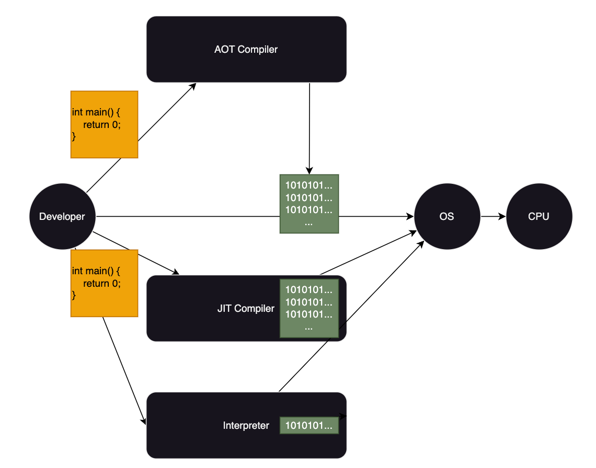
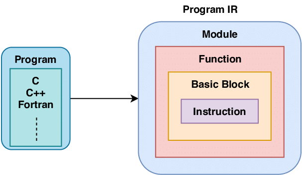

# LLVM And Popular Compilers

大多数人印象中的的程序典型编译流程：

1. 预处理 ( Preprocessing )
2. 编译 ( Compilation )
3. 汇编 ( Assemble )
4. 链接 ( Linking )

这也是 Unix 操作系统上 GCC 编译器编译 C 代码的编译流程。

## LLVM

LLVM 则是一个 modulized 的编译器基础设施，提供了编译器开发所需的各种工具和库。

LLVM 有自己的语言，LLVM assembly language，有自己的一套[语法](https://llvm.org/docs/LangRef.html#syntax)和[结构](https://llvm.org/docs/LangRef.html#high-level-structure)，是一个静态单赋值的代码表示（code representation），同时提供了类型安全、接近于汇编（low level）的运算操作，还有很强的灵活性，几乎可以表示一切其他语言。

设计成三种等价的不同形式来使用。

### LLVM assembly language

是文件文本存储格式。文件后缀是 `.ll`。
[示例](https://godbolt.org/z/Whec98z15)

### LLVM bitcode

LLVM bitcode 是文件二进制存储格式，文件后缀是 `.bc`。

### LLVM IR (Intermediate Representation)

LLVM IR 是代码表示在内存中的表示。因为通常用作其他语言实现的中间表示，所以被称作 IR ，官方设计目标是成为 universal IR。

下面统一称作 LLVM IR。

LLVM 项目提供了完善的工具链，提供以下编译能力：

- AOT(Ahead of Time) 静态编译器，提前把 LLVM IR 编译到可执行文件，直接运行
- JIT(Just in Time)  动态解释器，运行时先编译，再执行
- Interpreter        动态解释器，运行时直接解释执行 LLVM IR



### [主要包括以下工具](https://llvm.org/docs/GettingStarted.html#llvm-tools)

```text
llvm-ar

The archiver produces an archive containing the given LLVM bitcode files, optionally with an index for faster lookup.

llvm-as

The assembler transforms the human readable LLVM assembly to LLVM bitcode.

llvm-dis

The disassembler transforms the LLVM bitcode to human readable LLVM assembly.

llvm-link

llvm-link, not surprisingly, links multiple LLVM modules into a single program.

lli

lli is the LLVM interpreter, which can directly execute LLVM bitcode (although very slowly…). For architectures that support it (currently x86, Sparc, and PowerPC), by default, lli will function as a Just-In-Time compiler (if the functionality was compiled in), and will execute the code much faster than the interpreter.
可以使用 --force-interpreter 选项来使用解释器执行。

llc

llc is the LLVM backend compiler, which translates LLVM bitcode to a native code assembly file.

opt

opt reads LLVM bitcode, applies a series of LLVM to LLVM transformations (which are specified on the command line), and outputs the resultant bitcode.
opt can also run a specific analysis on an input LLVM bitcode file and print the results. Primarily useful for debugging analyses, or familiarizing yourself with what an analysis does.
```

### LLVM IR 层次结构和 Hello World



[语言参考](https://llvm.org/docs/LangRef.html)

[Hello World](https://godbolt.org/z/Wazb5zrf3)

```rust
@.str = private unnamed_addr constant [13 x i8] c"Hello World!\00", align 1, !dbg !0

define dso_local i32 @main() #0 !dbg !18 {
  %1 = alloca i32, align 4
  store i32 0, ptr %1, align 4
  %2 = call i32 (ptr, ...) @printf(ptr noundef @.str), !dbg !22
  ret i32 0, !dbg !23
}

declare i32 @printf(ptr noundef, ...) #1

attributes #0 = { noinline nounwind optnone "target-cpu"="x86-64" "no-trapping-math"="true"}
attributes #1 = { "target-cpu"="x86-64" "no-trapping-math"="true" }
```

### Clang

clang++ 是一个 LLVM native 的 C/C++ 编译器前端。
它是基于 LLVM 架构的 C++ 编译器，提供了对 C++ 语言的支持，并且可以生成目标代码。
clang++ 是 LLVM 项目中的一个具体实现，它使用 LLVM 提供的库来进行 C++ 代码的编译和优化。

以 Clang 举例，介绍一个 C 程序的编译流程。
使用如下命令可以输出 clang 的编译阶段。

```shell
clang -v && \
clang -ccc-print-phases -o test test.c
```

输出结果

```text
Homebrew clang version 16.0.6
Target: arm64-apple-darwin23.1.0
Thread model: posix
InstalledDir: /opt/homebrew/opt/llvm@16/bin
               +- 0: input, "test.c", c
            +- 1: preprocessor, {0}, cpp-output
         +- 2: compiler, {1}, ir
      +- 3: backend, {2}, assembler
   +- 4: assembler, {3}, object
+- 5: linker, {4}, image
6: bind-arch, "arm64", {5}, image
```

如下表所示
| input | processor  | compiler | backend   | assembler | linker & bind-arch |
|-------|------------|----------|-----------|-----------|--------------------|
| c     | cpp-output | ir       | assembler | object    | image              |
| .c    | .i         | .bc      | .s        | .o        | excutable          |

#### 1. 预处理

.c 文件编译成 .i 文件，完成宏替换。

```shell
clang -E -c test.c -o test.i
```

#### 2. 编译生成 IR (LLVM assembly language)

将源代码 .i 编译成 .bc LLVM IR 文件。
中间经过了一系列处理，详细介绍见[编译生成 IR](#2-编译生成-ir-llvm-assembly-language)

```shell
# bitcode encoding binary
clang -emit-llvm test.i -c -o test.bc
# llvm ir
clang -emit-llvm test.i -S -o test.ll
# use llvm-as to translates ir to LLVM bitcode
llvm-as test.ll
# use llvm-dis to convert LLVM bitcode to ir
llvm-dis test.bc
```

#### 3. 汇编

```shell
llc test.bc -o test.s
```

#### 4. Assembler

```shell
# gnu as
as test.s -o test.o
```

#### 5. 生成对应平台的可执行文件

```shell
# gnu linker
ld test.o -o test
# llvm linker llvm-lld
ld.lld -arch arm64 -platform_version macos 14.0.0 14.0.0 -o test test.o
# or use clang
clang -fuse-ld=lld -o test test.o
```

#### 6. bind-arch

bind-arch 用来处理目标产物所需的平台信息。可以通过如下命令查看绑定后的内容。

```shell
file test
```

可能的输出

```shell
test: Mach-O 64-bit executable arm64
```

#### 任意中间产物输出命令

当然也可以通过 clang 内置的选项在编译的任意过程终止，并输出编译产物。

```shell
-emit-ast               Emit Clang AST files for source inputs
-emit-llvm              Use the LLVM representation for assembler and object files
-S                      Only run preprocess and compilation steps, generate assembly
```

## 流行的编译器

### Rustc

[Overview of the compiler](https://rustc-dev-guide.rust-lang.org/overview.html)
[source code representation](https://rustc-dev-guide.rust-lang.org/part-3-intro.html)

编译过程如下：

- Lex and parse
- AST lowering - HIR
- HIR lowernig - THIR
- MIR lowering - MIR
- Code generation - LLVM IR

### Swiftc

与 clang 一样，swiftc 是LLVM编译架构的一个前端。
[Swift 的编译过程中](https://github.com/apple/swift/blob/main/docs/SIL.rst)的中间结果

```shell
-dump-ast              解析和类型检查源文件 & 转换成 AST
-dump-parse            解析源文件 & 转换成 AST  
-emit-assembly         生成汇编文件
-emit-bc               生成 LLVM Bitcode 文件
-emit-executable       生成已链接的可执行文件
-emit-imported-modules 生成已导入的库
-emit-ir               生成 LLVM IR 文件
-emit-silgen           生成 raw SIL 文件（第一个阶段）
-emit-sil              生成 canonical SIL 文件（第2个阶段）
-print-ast             解析和类型检查源文件 & 转换成更简约的格式更好的 AST
-typecheck             解析和类型检查源文件
```

编译过程如下：

- lex and parse - AST
- Sema - AST with annotation
- SILGen - raw SIL
- Optimize Pass - SIL
- IRGen - LLVM IR
- Binary

### Kotlin/Native

Kotlin 是一种由 JetBrains 开发的现代编程语言，Kotlin/Native 是使用 LLVM 工具链的 Kotlin 编译器、运行时实现和本机代码生成工具的 LLVM 后端。 Kotlin/Native 的主要设计目的是允许在不需要或不可能使用虚拟机的平台（例如 iOS 或嵌入式目标）上进行编译，或者在开发人员愿意生成合理大小的独立程序而无需交付虚拟机的平台上进行编译。额外的执行运行时间。

[kotlinc-native 编译过程如下](https://llvm.org/devmtg/2018-04/slides/Igotti-Developing%20Kotlin.pdf)：

- lex and parse - AST
- AST lowering - HIR
- IRGen - LLVM IR
- Target

### CUDA NVCC

[NVVM IR](https://docs.nvidia.com/cuda/nvvm-ir-spec/index.html)

NVVM IR 是 LLVM IR 的一个子集，增加了一些规则、限制和约定以及一些内置函数。

## Reference

[JIT AOT](https://it-blog-cn.com/blogs/jvm/jit_aot.html)
[AOT JIT](https://blog.csdn.net/cristianoxm/article/details/126032096)
[LLVM Docs](https://llvm.org/docs/LangRef.html)
