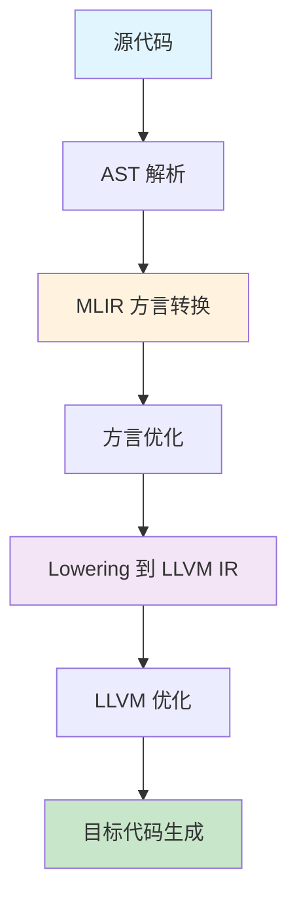
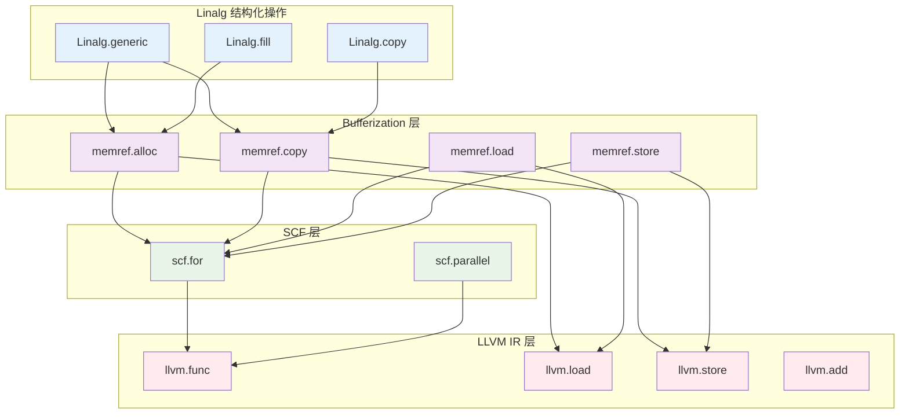
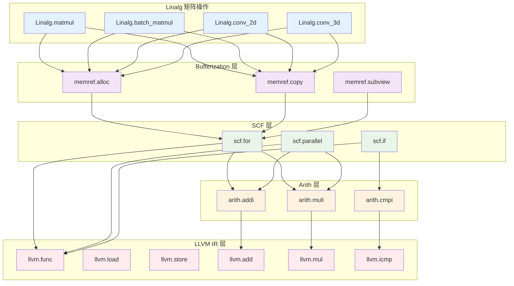
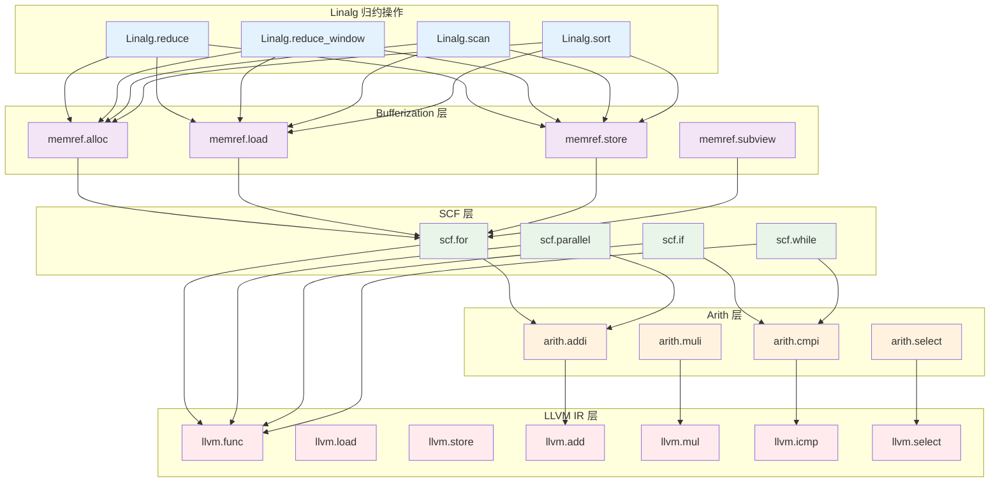
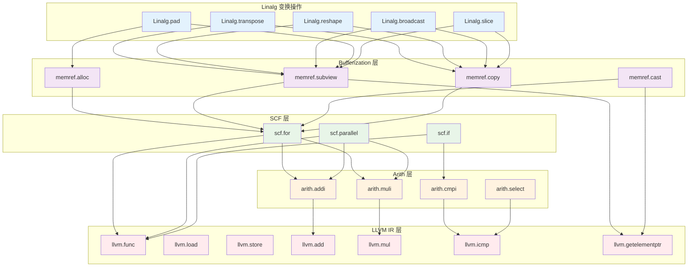

# MLIR Linalg 到 LLVM 的 Lowering 过程

本文档详细展示了 MLIR 中 Linalg 方言到 LLVM IR 的 lowering 过程。Linalg 是 MLIR 中用于表示高级张量操作的方言，它提供了丰富的张量操作原语，这些操作最终需要被转换为底层的 LLVM IR 才能执行。

## 1. Linalg 结构化操作分组

**说明**：这一组包括 `linalg.generic`、`linalg.fill`、`linalg.copy` 等通用张量操作。它们通常会先经过 bufferization（张量到内存的转换），再通过 SCF（结构化控制流）降级为循环，最终转为 LLVM IR。

**Lowering 路径**：
- **Linalg → Bufferization**：张量操作转换为内存操作
- **Bufferization → SCF**：内存操作转换为结构化控制流
- **SCF → LLVM IR**：控制流转换为 LLVM 函数和指令

## 2. Linalg 矩阵操作分组

**说明**：这一组包括 `linalg.matmul`、`linalg.batch_matmul`、`linalg.conv_2d`、`linalg.conv_3d` 等矩阵和卷积相关操作。这些操作通常涉及复杂的嵌套循环和大量的算术运算。

**Lowering 路径**：
- **Linalg → Bufferization**：矩阵操作转换为内存分配和访问
- **Bufferization → SCF**：内存操作转换为嵌套循环结构
- **SCF → Arith**：循环体中的计算转换为算术操作
- **Arith → LLVM IR**：算术操作转换为 LLVM 指令

## 3. Linalg 归约操作分组

**说明**：这一组包括 `linalg.reduce`、`linalg.reduce_window`、`linalg.scan`、`linalg.sort` 等归约与排序操作。这些操作需要遍历张量并执行累积或比较操作，通常涉及复杂的控制流逻辑。

**Lowering 路径**：
- **Linalg → Bufferization**：归约操作转换为内存访问模式
- **Bufferization → SCF**：内存访问转换为循环和条件控制
- **SCF → Arith**：归约逻辑转换为算术和比较操作
- **Arith → LLVM IR**：算术操作转换为 LLVM 指令

## 总结

MLIR 的 Linalg 方言提供了丰富的张量操作原语，这些操作通过不同的 lowering 路径最终转换为 LLVM IR。主要的 lowering 步骤包括：

1. **Bufferization**：将张量操作转换为内存操作
2. **SCF Lowering**：将内存操作转换为结构化控制流
3. **Arith Lowering**：将算术操作转换为底层指令
4. **LLVM IR Generation**：最终生成 LLVM IR

这种分层设计使得 MLIR 能够：
- 保持高级操作的语义清晰性
- 提供灵活的优化机会
- 支持不同的目标平台
- 实现渐进式的 lowering 过程

## 4. Linalg 变换操作分组

**说明**：这一组包括 `linalg.transpose`、`linalg.reshape`、`linalg.broadcast`、`linalg.pad`、`linalg.slice` 等张量变换操作。这些操作主要涉及张量的形状变换和索引计算，有些可以直接转换为 LLVM 的指针操作。

**Lowering 路径**：
- **Linalg → Bufferization**：变换操作转换为内存视图和索引计算
- **Bufferization → SCF**：复杂变换转换为循环结构
- **SCF → Arith**：索引计算转换为算术操作
- **Arith → LLVM IR**：算术操作转换为 LLVM 指令
- **直接路径**：部分操作可直接转换为 LLVM 的 `getelementptr` 指令

